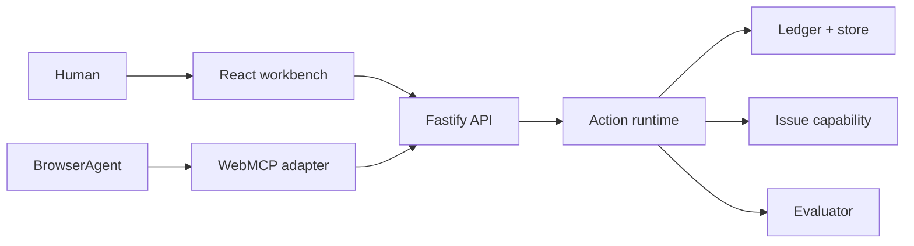

# Architecture

OpenAgentLab is a deliberately small vertical slice with strict boundaries.

`src/domain` contains runtime-safe Zod contracts, the ledger state machine, fixtures, and pure evaluation logic. `src/server/runtime.ts` is the trust boundary: it proposes and previews actions, verifies approval credentials and resource revisions, invokes capabilities, and records outcomes. The injected `Store` makes persistence replaceable; the local implementation serializes transactions and atomically replaces a mode-0600 JSON file. `src/client` renders only API state and never grants execution authority.

A scenario run uses the deterministic adapter to select a tool from its goal and current contract descriptions. Consequential calls become ledger proposals. Approval crosses the API with a high-entropy process-local token whose hash is persisted. Execution rechecks state and optimistic revision. Evaluation consumes observed selections and verified outcomes, not hidden reasoning.

Trust boundaries are browser/API, runtime/capability, and persisted/external data. Expected failures include expired approvals after restart, stale previews, stale rollback state, malformed records, and capability errors. Current local persistence is crash-safe for single-process writes but not a multi-node database; production deployment requires a transactional store plus identity and authorization.
