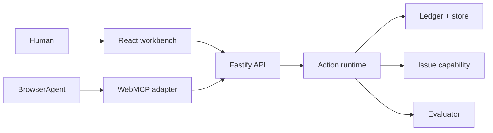

# Architecture

OpenAgentLab is a deliberately small vertical slice with strict boundaries.

`src/domain/tool-registry.ts` is the single source of truth for tool descriptions, schemas, risk, side effects, reversibility, and confirmation metadata. Snapshot/Tool Explorer, native WebMCP registration, runtime invocation, scenario evaluation, and confirmation UI all consume that registry; documentation identifies it as authoritative instead of maintaining another contract table. Contract changes replace the live native registrations by aborting the previous descriptor set and registering the new canonical set.

`src/server/runtime.ts` is the trust boundary: mutation tools create proposals only; the separate approval boundary verifies a server-held grant, human session, expiry, irreversible acknowledgement, and resource revision before execution. The injected `Store` serializes transactions and the JSON implementation atomically replaces a mode-0600 file. `src/client` renders API state and never grants execution authority.

A scenario run uses the deterministic contract adapter for repeatability. Actual WebMCP calls are separately labelled native observable runs and persist discovered contracts, selection, arguments, and results. A server-only approval secret is never returned across the API; the browser carries only an HttpOnly human-session cookie. Evaluation consumes observed selections and verified outcomes, not hidden reasoning.

Trust boundaries are browser/API, runtime/capability, and persisted/external data. Expected failures include expired approvals after restart, stale previews, stale rollback state, malformed records, and capability errors. Current local persistence is crash-safe for single-process writes but not a multi-node database; production deployment requires a transactional store plus identity and authorization.
